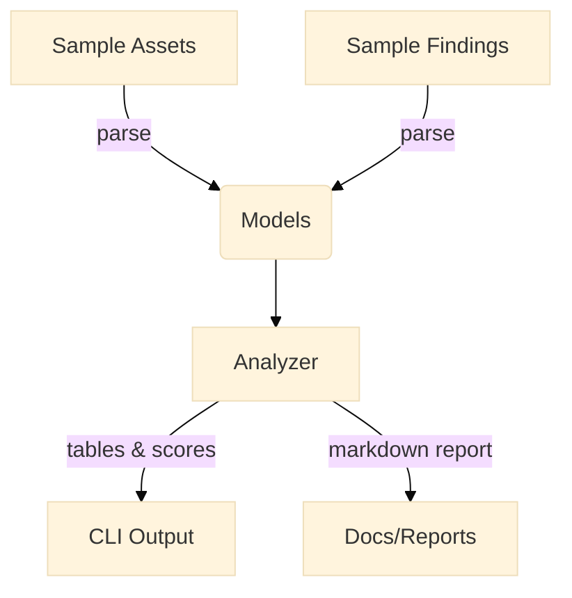

# Tenable Showcase Lab

[](./docs/index.md)
[](LICENSE)

> Educational lab showcasing Tenable® scanning concepts and three standout capabilities—**real‑time plugin updates (Live Results)**, **prioritized exposure scoring (Lumin‑style)**, and **asset‑centric risk views**—using sample data and a small Python CLI.

## TL;DR
```bash
# create venv and install (requires Python 3.12+ and uv)
uv venv
uv pip install -e ".[dev]"

# run: see help
tenable-showcase --help

# quick demo with included sample data
tenable-showcase summarize examples/sample_assets.json examples/sample_findings.json
tenable-showcase exposure-score examples/sample_assets.json examples/sample_findings.json --report
```

> **Note**: This repository is **not** affiliated with Tenable, Inc. It is an educational demonstration that uses public concepts and fabricated sample data for learning.

## Why this Lab?
Security teams evaluate VM tools by how fast they surface risk, how well they prioritize, and how actionable asset views are. This lab walks through those ideas with a runnable CLI and docs.

### Top 3 Capabilities Demonstrated
1. **Live Results / Real‑Time Plugin Updates (Simulated)**  
   Demonstrates how up‑to‑date detection logic reduces time‑to‑risk insight without waiting for a full scan.
2. **Lumin‑Style Exposure Scoring (Simplified)**  
   Computes a normalized **Exposure Score (0–100)** from vuln severity, exploitability, asset criticality, and time since plugin release.
3. **Asset‑Centric Risk Views**  
   Aggregates findings by asset to spotlight your riskiest systems and misconfigs at a glance.

## Features
- Small **Typer** CLI with `summarize`, `exposure-score`, and `benchmark` commands
- **Rich** pretty tables for terminal output
- **MkDocs** docs site with architecture diagram (Mermaid)
- **Ruff + mypy + pytest** with GitHub Actions CI matrix
- **Dockerfile** and **Dev Container** for consistent runs
- **.env.example** and `config/defaults.yaml` for settings

## Quick Start
```bash
# 1) Setup
uv venv
uv pip install -e ".[dev]"

# 2) Try commands
tenable-showcase summarize examples/sample_assets.json examples/sample_findings.json
tenable-showcase exposure-score examples/sample_assets.json examples/sample_findings.json --top 5 --report
tenable-showcase benchmark --assets examples/sample_assets.json --findings examples/sample_findings.json

# 3) Run tests, lint, type-check
make test
make lint
make typecheck
```

## Architecture


## Example
```bash
tenable-showcase exposure-score examples/sample_assets.json examples/sample_findings.json --report
# => prints a ranked table and writes ./exposure_report.md
```

## Compliance & Mapping
See [docs/compliance.md](docs/compliance.md) for a light MITRE ATT&CK mapping of vuln discovery & prioritization workflows.

## License
MIT — see [LICENSE](LICENSE).
